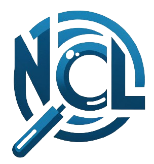

<!-- Improved compatibility of back to top link: See: https://github.com/othneildrew/Best-README-Template/pull/73 -->
<a name="readme-top"></a>
<!--
*** Thanks for checking out the Best-README-Template. If you have a suggestion
*** that would make this better, please fork the repo and create a pull request
*** or simply open an issue with the tag "enhancement".
*** Don't forget to give the project a star!
*** Thanks again! Now go create something AMAZING! :D
-->


<!-- PROJECT SHIELDS -->
<!--
*** I'm using markdown "reference style" links for readability.
*** Reference links are enclosed in brackets [ ] instead of parentheses ( ).
*** See the bottom of this document for the declaration of the reference variables
*** for contributors-url, forks-url, etc. This is an optional, concise syntax you may use.
*** https://www.markdownguide.org/basic-syntax/#reference-style-links
-->
[![Contributors][contributors-shield]][contributors-url]
[![Forks][forks-shield]][forks-url]
[![Stargazers][stars-shield]][stars-url]
[![Issues][issues-shield]][issues-url]
[![MIT License][license-shield]][license-url]
[![LinkedIn][linkedin-shield]][linkedin-url]


<!-- PROJECT LOGO -->
<br />
<div align="center">
  <a href="https://github.com/alvroble/NetConfigLens">
    
  </a>

<h3 align="center">NetConfigLens</h3>

  <p align="center">
    Analysis of Netkwork Equipment Configuration using AI
    <br />
    <a href="https://github.com/alvroble/NetConfigLens"><strong>Explore the docs »</strong></a>
    <br />
    <br />
    <a href="https://github.com/alvroble/NetConfigLens">View Demo</a>
    ·
    <a href="https://github.com/alvroble/NetConfigLens/issues">Report Bug</a>
    ·
    <a href="https://github.com/alvroble/NetConfigLens/issues">Request Feature</a>
  </p>
</div>


<!-- TABLE OF CONTENTS -->
<details>
  <summary>Table of Contents</summary>
  <ol>
    <li>
      <a href="#about-the-project">About The Project</a>
      <ul>
        <li><a href="#built-with">Built With</a></li>
      </ul>
    </li>
    <li>
      <a href="#prerequisites">Prerequisites</a>
    </li>
    <li><a href="#usage">Usage</a></li>
    <li><a href="#contributing">Contributing</a></li>
    <li><a href="#license">License</a></li>
    <li><a href="#contact">Contact</a></li>
    <li><a href="#acknowledgments">Acknowledgments</a></li>
  </ol>
</details>


<!-- ABOUT THE PROJECT -->
## About The Project

In this project, it is developed an AI system for error detection in network equipment configurations, such as routers configurations, improving the current state-of-the-art in the relevant metrics, and demonstrating AI’s potential in telecommunications network management. Two design alternatives based on transformer networks are developed using Python and frameworks like TensorFlow, Keras, and PyTorch. Several tests are conducted to compare the performance of these models with the existing state-of-the-art alternatives. Ultimately, significant improvements in the results are achieved for both design alternatives, showcasing the potential of NLP techniques using transformers and large language models (LLMs), especially in the case of pretrained models.

<p align="right">(<a href="#readme-top">back to top</a>)</p>


### Built With


[](https://huggingface.co)

[![Keras][Keras]][Keras-url]
[![TensorFlow][TensorFlow]][TensorFlow-url]
[![PyTorch][PyTorch]][PyTorch-url]

![Google-Colab][Google-Colab]


<p align="right">(<a href="#readme-top">back to top</a>)</p>


## Prerequisites

In Google Colab, it is needed to install the following packages
* transformers (using TensorFlow)
  ```sh
  !pip install -q transformers
  ```
* transformers and accelerate (using PyTorch)
  ```sh
  !pip install -U -q transformers
  !pip install -U -q accelerate
  ```

<p align="right">(<a href="#readme-top">back to top</a>)</p>


<!-- USAGE EXAMPLES -->
## Usage
Two Colab notebooks are provided:
* `NCL_GPT2`. Here, a GPT-2 model is trained from scratch with Cisco configuration files in order to detect configuration mistakes. Then, evaluation is carried out using a configuration file with 70 mistakes (approximately 10% of the word count).
* `NCL_GPT2_Pretrained`. Here, it is used an already trained GPT-2 model, fine-tuning with 100 Cisco configuration files in order to detect configuration mistakes. Then, evaluation is carried out using a configuration file with 70 mistakes (approximately 10% of the word count).

The used dataset of 100 Cisco PE config examples is provided. Anyone can train the models from this examples as done in the notebooks provided. If you want to run this on your own Google Colab, you should be aware of mantaining the folder and file structure.

<p align="right">(<a href="#readme-top">back to top</a>)</p>


<!-- CONTRIBUTING -->
## Contributing

Contributions are what make the open source community such an amazing place to learn, inspire, and create. Any contributions you make are **greatly appreciated**.

If you have a suggestion that would make this better, please fork the repo and create a pull request. You can also simply open an issue with the tag "enhancement".
Don't forget to give the project a star! Thanks again!

1. Fork the Project
2. Create your Feature Branch (`git checkout -b feature/AmazingFeature`)
3. Commit your Changes (`git commit -m 'Add some AmazingFeature'`)
4. Push to the Branch (`git push origin feature/AmazingFeature`)
5. Open a Pull Request

<p align="right">(<a href="#readme-top">back to top</a>)</p>


<!-- LICENSE -->
## License

Distributed under the MIT License. See `LICENSE.txt` for more information.

<p align="right">(<a href="#readme-top">back to top</a>)</p>


<!-- CONTACT -->
## Contact

Alvaro Robledo - alv.rbarba@gmail.com

Project Link: [https://github.com/alvroble/NetConfigLens](https://github.com/alvroble/NetConfigLens)

<p align="right">(<a href="#readme-top">back to top</a>)</p>


<!-- ACKNOWLEDGMENTS -->
## Acknowledgments

This work is based on and inspired by [Javier Antich's](https://www.linkedin.com/in/javier-antich-romaguera/) work:
* [https://github.com/javier-antich](https://github.com/javier-antich)
* [https://github.com/javier-antich/ml4nce](https://github.com/javier-antich/ml4nce)
* [Machine Learning for Network and Cloud Engineers: Get ready for the next Era of Network Automation](https://www.amazon.es/Machine-Learning-Network-Cloud-Engineers-ebook/dp/B0BT6YZC33)

<p align="right">(<a href="#readme-top">back to top</a>)</p>


<!-- MARKDOWN LINKS & IMAGES -->
<!-- https://www.markdownguide.org/basic-syntax/#reference-style-links -->
[contributors-shield]: https://img.shields.io/github/contributors/alvroble/NetConfigLens.svg?style=for-the-badge
[contributors-url]: https://github.com/alvroble/NetConfigLens/graphs/contributors
[forks-shield]: https://img.shields.io/github/forks/alvroble/NetConfigLens.svg?style=for-the-badge
[forks-url]: https://github.com/alvroble/NetConfigLens/network/members
[stars-shield]: https://img.shields.io/github/stars/alvroble/NetConfigLens.svg?style=for-the-badge
[stars-url]: https://github.com/alvroble/NetConfigLens/stargazers
[issues-shield]: https://img.shields.io/github/issues/alvroble/NetConfigLens.svg?style=for-the-badge
[issues-url]: https://github.com/alvroble/NetConfigLens/issues
[license-shield]: https://img.shields.io/github/license/alvroble/NetConfigLens.svg?style=for-the-badge
[license-url]: https://github.com/alvroble/NetConfigLens/blob/master/LICENSE.txt
[linkedin-shield]: https://img.shields.io/badge/-LinkedIn-black.svg?style=for-the-badge&logo=linkedin&colorB=555
[linkedin-url]: https://linkedin.com/in/alvarorobledobarba
[product-screenshot]: images/screenshot.png
[Google-Colab]: https://img.shields.io/badge/Colab-Run_in_Google_Colab-blue?logo=Google&logoColor=FDBA18
[Keras]: https://img.shields.io/badge/Keras-%23D00000.svg?style=for-the-badge&logo=Keras&logoColor=white
[Keras-url]: https://keras.io/
[TensorFlow]: https://img.shields.io/badge/TensorFlow-%23FF6F00.svg?style=for-the-badge&logo=TensorFlow&logoColor=white
[TensorFlow-url]: https://www.tensorflow.org/
[PyTorch]: https://img.shields.io/badge/PyTorch-%23EE4C2C.svg?style=for-the-badge&logo=PyTorch&logoColor=white
[PyTorch-url]: https://pytorch.org/
